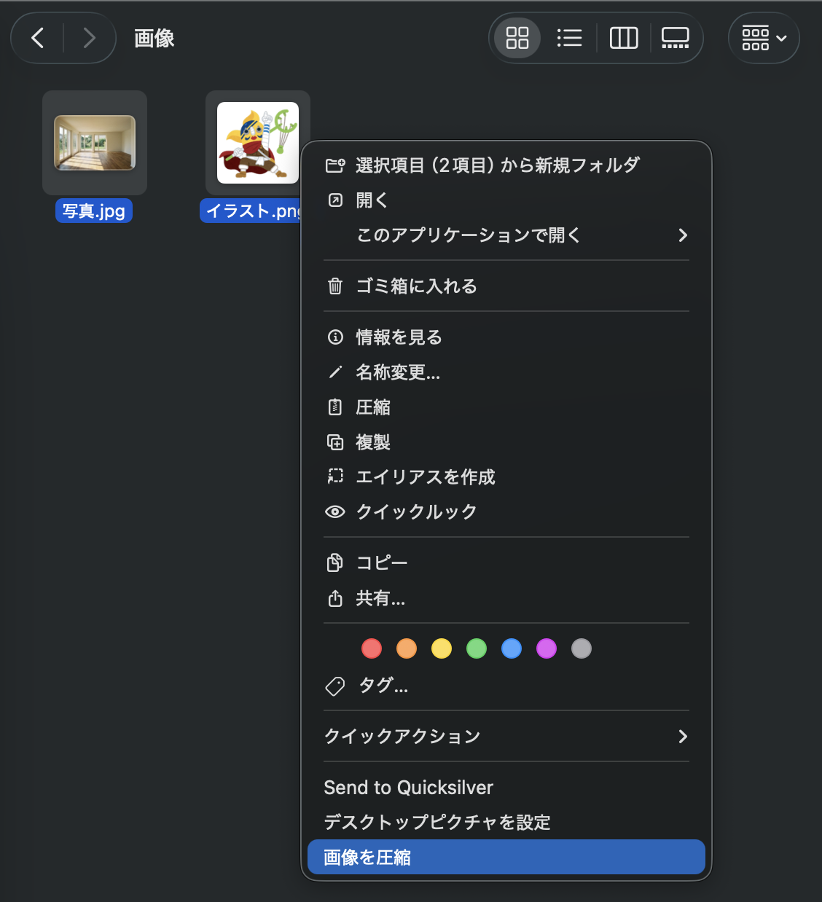

# 画像を圧縮 - macOS Finder Quick Action

Finder の右クリックメニューから画像を圧縮できるクイックアクションです。



## 機能

- **JPEG**: 品質80%で再圧縮
- **PNG**: pngquant で高品質圧縮（同梱済み、インストール不要）
- **HEIC/HEIF**: JPEG に変換して圧縮
- **WebP**: cwebp で再圧縮（要 `brew install webp`）

圧縮後のファイルは `元ファイル名_compressed.拡張子` として同じフォルダに保存されます（元ファイルは変更されません）。

## インストール

1. [Releases](../../releases/latest) から `画像を圧縮.zip` をダウンロード
2. ダブルクリックで解凍
3. `画像を圧縮.workflow` をダブルクリック
4. 「インストール」を選択

これだけで完了です。

### メニューに表示されない場合

**システム設定** → **プライバシーとセキュリティ** → **機能拡張** → **Finder** で「画像を圧縮」を有効にしてください。

## 使い方

1. Finder で画像ファイル（複数選択可）を右クリック
2. 「画像を圧縮」を選択
3. 圧縮完了の通知が表示されます

### 初回利用時のアクセス権限について

初めて PNG を圧縮する際に「"pngquant" から、"〇〇" フォルダ内のファイルへのアクセス権を求められています」というダイアログが表示されることがあります。「許可」を選択してください。一度許可すれば、以降は同じフォルダで表示されません。

## アンインストール

以下のフォルダから `画像を圧縮.workflow` を削除してください:

```
~/Library/Services/
```

Finder で `Cmd + Shift + G` を押して上記パスを貼り付けると開けます。

## ライセンス

MIT
